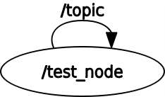

# intra process ping latency test

This package records intra process communication latency and publishes its topic statistics.

## rqt_graph


## Setup
```
$ mkdir -p ~/ros2_ws/src
$ cd ~/ros2_ws
$ git clone -b qos_history_1 https://github.com/hsgwa/intra_process_ping_latency_test.git src/intra_process_ping_latency_test
$ colcon build --packages-select intra_process_ping_latency_test
```

## Run
1. Run ping_test.

```
$ . ~/ros2_ws/install/local_setup.bash
$ ros2 run intra_process_ping_latency_test ping_test
  # topic statistics is published to /topic_statistics topic
```

2. Echo `/topic_statistics` topic.
```
$ ros2 topic echo /topic_statistics
```
